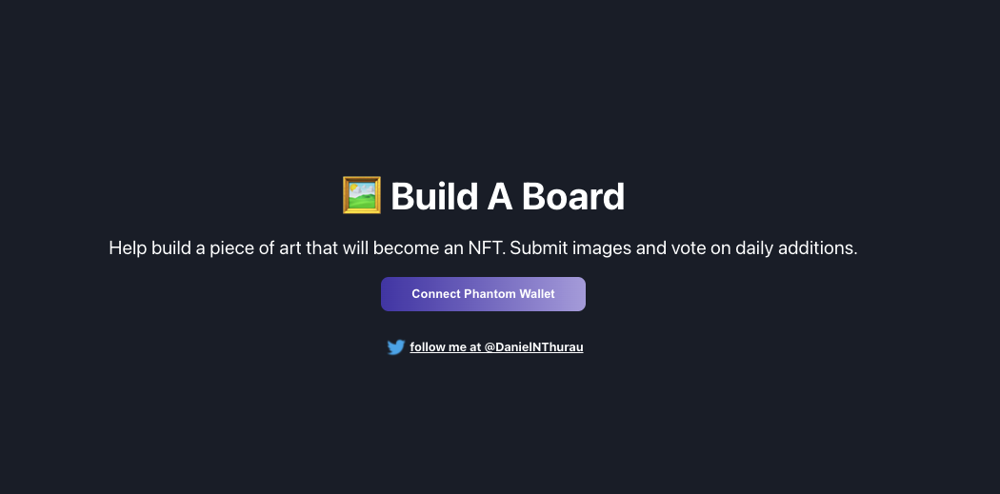
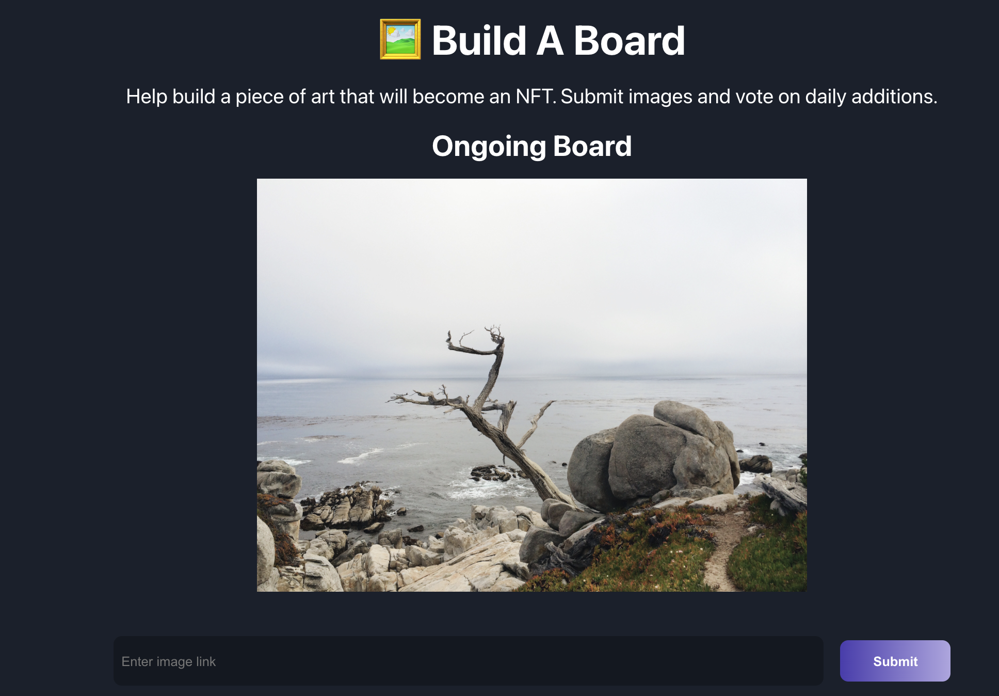
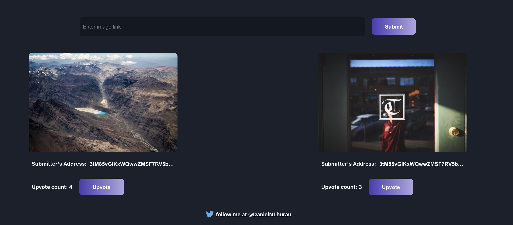

# build-a-board-solana

## Description

build-a-board-solana is the React App for the Build-A-Board Web3 application. It handles wallet integration as well as interacting with Solana SystemPRogram to submit and upbote images.  You can access the application here: https://buildaboard.danielthurau.repl.co.

- [buildaboard](https://github.com/DanielThurau/buildaboard/)

## Installation

### Required Tools

1. [Replit](https://replit.com/) - a cool react app development tool. https://replit.com/@DanielThurau/build-a-board-solana


### Cloning The Project

You can either fork the repo or clone it directly with

```shell
$ git clone https://github.com/DanielThurau/build-a-board-solana.git
$ cd build-a-board
```

### Usage

Navigate to https://replit.com/@DanielThurau/build-a-board-solana and start the development server.

## Screen Shots








## Credits

Shout out to the _buildspace team. Check out their website at https://buildspace.so/. This is one of their tutorials.

## License

See LICENSE.md

> MIT License
>
> Copyright (c) 2021 Daniel Thurau